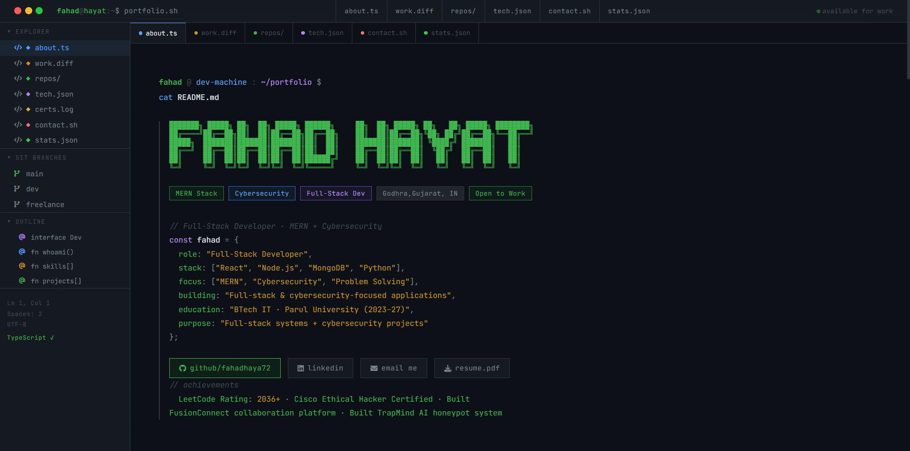

# 🌟 Fahad Hayat – Personal Portfolio

Welcome to my **personal portfolio website** – a sleek and responsive single-page site built using **HTML**, **CSS**, and **JavaScript**. It showcases my skills, projects, and contact information in a clean, professional layout.

🔗 **Live Site**: [https://portfolio25-two-lilac.vercel.app/](https://portfolio25-two-lilac.vercel.app/)

---

## 🖼️ Preview

 <!-- Optional: Replace with actual image -->

---

## 🔧 Tech Stack

- **HTML5** – Semantic and accessible structure  
- **CSS3** – Custom styling with responsive layout  
- **JavaScript** – Interactivity and dynamic behavior  
- **Vercel** – Fast and easy deployment  

---

## 📁 Project Structure

```
portfolio/
├── index.html                         # Main homepage
├── styles.css                         # Stylesheet
├── main.js                            # JavaScript
├── portfoliopreview.png               # Preview image
└── Readme.md                          # This file
```

---

## 🚀 How to Run Locally

To run this project on your local machine:

1. **Clone the Repository**  
```bash
git clone https://github.com/fahadhayat5586/portfolio.git
cd portfolio
```

2. **Open in Browser**  
Just open `index.html` in any modern browser (Chrome, Firefox, Edge, etc.)

> No installation or build step required – it's pure HTML/CSS/JS!

---

## 🌐 Deployment

This portfolio is **live on Vercel**:
> 🔗 [https://portfolio25-two-lilac.vercel.app/](https://portfolio25-two-lilac.vercel.app/)

To redeploy or fork:
```bash
vercel deploy
```

---

## 📩 Contact

If you'd like to collaborate or get in touch:

- 🔗 [GitHub](https://github.com/fahadhayat5586)
- ✉️ Email: cyberfahad72@gmail.com
- 💼 LinkedIn: *Coming soon*

---

## 📄 License

This project is open source under the **MIT License**. Feel free to use, customize, or improve it.

---

> Made with ❤️ by **Fahad Hayat**
